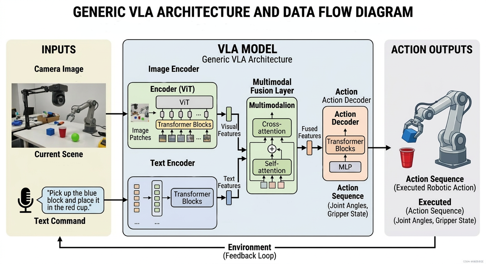
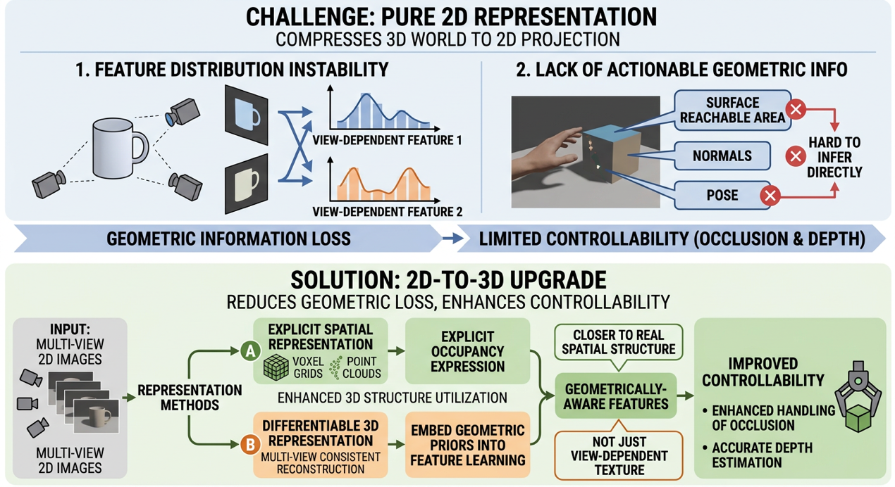
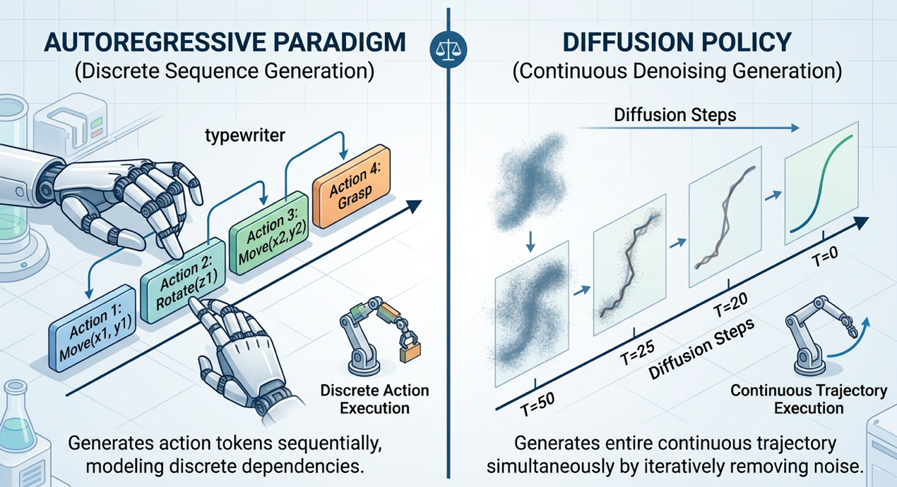
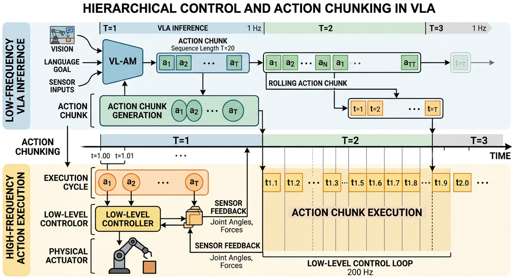
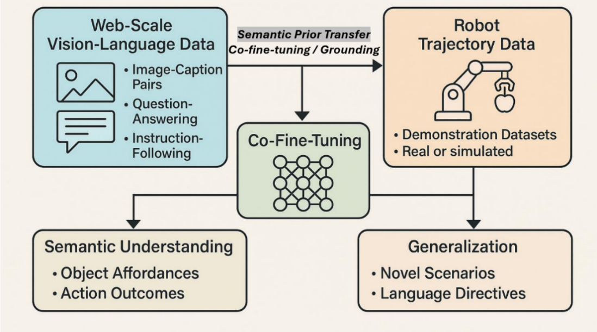

# VLA（视觉-语言-动作）研究综述（2026）

**Organization:** PKUSAIIC  
**Language:** Chinese  
**Topic:** Vision-Language-Action (VLA) / Embodied AI  
**Status:** Public Release  

---

## 摘要
本文系统梳理视觉-语言-动作（VLA）模型的定义框架、能力层级、核心架构、训练范式、关键技术挑战与产业发展趋势，重点分析其从实验室原型走向工业级具身智能系统所面临的核心瓶颈与代表性突破路径。

---

## 目录
- 一、VLA的定义框架、能力层级与现状评估
- 二、VLA的核心架构设计与实现机理
- 三、VLA训练范式
- 四、核心技术挑战：从“实验室 Demo”到“通用 AI”的阻碍
- 五、应对路径与发展趋势：迈向工业级具身智能

---

<b>一、 VLA的定义框架、能力层级与现状评估</b>

<b>1.1  VLA</b><b>的核心定义与技术范畴</b>

<b>VLA</b><b>（视觉</b><b>-</b><b>语言</b><b>-</b><b>动作）模型是当前具身智能领域的核心模型</b><b>。</b>VLA能够直接将机器视觉画面和语言指令融合在一起，一步到位地输出机器人应该执行的动作，这种端到端的范式——即直接从原始感官输入映射到最终动作输出，彻底打破了传统系统中“感知-建图-规划-控制”层层解耦的繁琐中间模块——极大提升了系统的反应效率。

<b>动作表征的粒度选择，决定了机器人是笨拙还是灵巧。</b>在VLA的架构里，动作可以是抽象的高级指令（如：拿杯子），也可以是底层连续的电流信号（如：各个关节转动多少度）。这种从宏观到微观的跨度被称为动作表征谱系（注：可理解为机器人的动作词典），词典越底层、越精细，机器人的动作就越丝滑，但模型的训练难度也呈指数级上升。

<b>VLA</b><b>并不等同于单纯的</b><b>“</b><b>看图说话</b><b>”</b><b>机器人，其核心分水岭在于能否生成物理动作。</b>传统的视觉语言模型（VLM）即便具备强大的图文理解能力，能进行复杂的逻辑推理甚至生成详细的行动步骤文本（例如告诉你“需要先避开水杯，再抓取苹果”），但只要它无法直接输出驱动电机的物理控制信号，那它依然只是VLM；只有当它能伸出机械臂去抓取苹果时，才算跨入了VLA的门槛。

<b>1.2  VLA</b><b>能力分级框架：从技术原理到应用效能</b>

为了直观评估VLA的进化水平，我们将其能力划分为四个递进的能力层级，如表1所示。随着层级的提升，机器人面对的任务复杂度越来越高，对未知环境的适应能力（即泛化能力）也越来越强。只有跨越前三个层级，VLA才能最终触及通用具身智能（AGI）的终极目标。

表1 ：VLA（视觉-语言-动作）模型能力分级全景评估表

<table class=MsoNormalTable border=1 cellspacing=30 cellpadding=0 width=609
 style='width:456.9pt;border:none #1F1F1F 1.0pt'>
 <thead>
  <tr style='height:32.4pt'>
   <td width=68 style='width:50.8pt;border-top:solid windowtext 1.5pt;
   border-left:none;border-bottom:solid windowtext 1.0pt;border-right:none;
   padding:3.0pt 4.5pt 3.0pt 4.5pt;height:32.4pt'>
   
能力层级

   
(Level)

   </td>
   <td width=97 style='width:72.65pt;border-top:solid windowtext 1.5pt;
   border-left:none;border-bottom:solid windowtext 1.0pt;border-right:none;
   padding:3.0pt 4.5pt 3.0pt 4.5pt;height:32.4pt'>
   
核心通俗理解

   </td>
   <td width=90 style='width:67.4pt;border-top:solid windowtext 1.5pt;
   border-left:none;border-bottom:solid windowtext 1.0pt;border-right:none;
   padding:3.0pt 4.5pt 3.0pt 4.5pt;height:32.4pt'>
   
典型应用场景

   </td>
   <td width=197 style='width:147.9pt;border-top:solid windowtext 1.5pt;
   border-left:none;border-bottom:solid windowtext 1.0pt;border-right:none;
   padding:3.0pt 4.5pt 3.0pt 4.5pt;height:32.4pt'>
   
当前痛点与技术瓶颈

   </td>
   <td width=146 style='width:109.15pt;border-top:solid windowtext 1.5pt;
   border-left:none;border-bottom:solid windowtext 1.0pt;border-right:none;
   padding:3.0pt 4.5pt 3.0pt 4.5pt;height:32.4pt'>
   
2025-2026代表性进展

   </td>
  </tr>
 </thead>
 <tr style='height:57.25pt'>
  <td width=68 style='width:50.8pt;border:none;padding:3.0pt 4.5pt 3.0pt 4.5pt;
  height:57.25pt'>
  

  
<b>Level 1</b><b>：指令</b><b>-</b><b>动作映射</b> 

  
<i>(</i><i>任务复现</i><i>)</i>

  

  </td>
  <td width=97 style='width:72.65pt;border:none;padding:3.0pt 4.5pt 3.0pt 4.5pt;
  height:57.25pt'>
  

  
 

  
听到单一指令，执行一个确定的抓取动作。

  

  </td>
  <td width=90 style='width:67.4pt;border:none;padding:3.0pt 4.5pt 3.0pt 4.5pt;
  height:57.25pt'>
  
工业流水线分拣、实验室桌面物品拾取。

  </td>
  <td width=197 style='width:147.9pt;border:none;padding:3.0pt 4.5pt 3.0pt 4.5pt;
  height:57.25pt'>
  
<b>泛化能力极弱：</b> 换个背景、光线或物体位置稍微偏移，机器人就会彻底罢工。

  </td>
  <td width=146 style='width:109.15pt;border:none;padding:3.0pt 4.5pt 3.0pt 4.5pt;
  height:57.25pt'>
  
<b>工业大模型化：</b> Covariant、梅卡曼德等企业在结构化产线实现“开箱即用”的高精度抓取。

  </td>
 </tr>
 <tr style='height:67.3pt'>
  <td width=68 style='width:50.8pt;border:none;padding:3.0pt 4.5pt 3.0pt 4.5pt;
  height:67.3pt'>
  

  
<b>Level 2</b><b>：技能序列组合</b> 

  
<i>(</i><i>程序性任务</i><i>)</i>

  

  </td>
  <td width=97 style='width:72.65pt;border:none;padding:3.0pt 4.5pt 3.0pt 4.5pt;
  height:67.3pt'>
  

  
把“走、抓、放”等已有技能串联成组合拳执行。

  

  </td>
  <td width=90 style='width:67.4pt;border:none;padding:3.0pt 4.5pt 3.0pt 4.5pt;
  height:67.3pt'>
  
家庭机器人“泡茶”、仓储机器人“取货-打包”流水线。

  </td>
  <td width=197 style='width:147.9pt;border:none;padding:3.0pt 4.5pt 3.0pt 4.5pt;
  height:67.3pt'>
  
<b>环境抗扰动差：</b> 中间任何一步出错（如没抓稳），后续步骤就会引发灾难性崩溃；严重依赖预先编程或学习的固定技能库，灵活性受限。

  </td>
  <td width=146 style='width:109.15pt;border:none;padding:3.0pt 4.5pt 3.0pt 4.5pt;
  height:67.3pt'>
  
<b>LLM</b><b>智能调度：</b> SayCan等模型利用大模型做大脑，动态编排底层死板的动作库。

  </td>
 </tr>
 <tr style='height:63.65pt'>
  <td width=68 style='width:50.8pt;border:none;padding:3.0pt 4.5pt 3.0pt 4.5pt;
  height:63.65pt'>
  

  
<b>Level 3</b><b>：连续轨迹生成</b> 

  
<i>(</i><i>动态交互</i><i>)</i>

  

  </td>
  <td width=97 style='width:72.65pt;border:none;padding:3.0pt 4.5pt 3.0pt 4.5pt;
  height:63.65pt'>
  

  
直面物理环境，实时输出平滑、精细的连续动作。

  

  </td>
  <td width=90 style='width:67.4pt;border:none;padding:3.0pt 4.5pt 3.0pt 4.5pt;
  height:63.65pt'>
  
柔性线缆插拔、动态避障、人机递送工具协作。

  </td>
  <td width=197 style='width:147.9pt;border:none;padding:3.0pt 4.5pt 3.0pt 4.5pt;
  height:63.65pt'>
  
<b>Sim2Real</b><b>跨越难：</b> 仿真训练好，但在真机物理环境容易因传感器噪声和摩擦力影响；<b>真机数采成本极高：</b>真实物理世界的高质量连续轨迹数据高度依赖人工遥操作录制，成本高昂且极难实现规模化扩展。

  </td>
  <td width=146 style='width:109.15pt;border:none;padding:3.0pt 4.5pt 3.0pt 4.5pt;
  height:63.65pt'>
  
<b>基础模型爆发：</b> 采用流匹配技术的π0 (Pi0)、及极低算力成本的开源模型 SmolVLA。

  </td>
 </tr>
 <tr style='height:65.6pt'>
  <td width=68 style='width:50.8pt;border:none;border-bottom:solid windowtext 1.5pt;
  padding:3.0pt 4.5pt 3.0pt 4.5pt;height:65.6pt'>
  

  
<b>Level 4</b><b>：长时程开放任务</b> 

  
<i>(</i><i>高层智能</i><i>)</i>

  

  </td>
  <td width=97 style='width:72.65pt;border:none;border-bottom:solid windowtext 1.5pt;
  padding:3.0pt 4.5pt 3.0pt 4.5pt;height:65.6pt'>
  

  
 

  
无需明确步骤，自主推理并完成极其复杂的任务。

  

  </td>
  <td width=90 style='width:67.4pt;border:none;border-bottom:solid windowtext 1.5pt;
  padding:3.0pt 4.5pt 3.0pt 4.5pt;height:65.6pt'>
  
整理陌生凌乱房间、根据模糊图纸组装未知家具。

  </td>
  <td width=197 style='width:147.9pt;border:none;border-bottom:solid windowtext 1.5pt;
  padding:3.0pt 4.5pt 3.0pt 4.5pt;height:65.6pt'>
  
<b>常识与长程记忆缺失：</b> 极易发生“做到一半忘了要做什么”的规划漂移现象。

  </td>
  <td width=146 style='width:109.15pt;border:none;border-bottom:solid windowtext 1.5pt;
  padding:3.0pt 4.5pt 3.0pt 4.5pt;height:65.6pt'>
  
<b>引入</b><b>“</b><b>机器慢思考</b><b>”</b><b>：</b> Gemini Robotics 1.5 采用双系统，行动前先调用常识库进行逻辑推理。

  </td>
 </tr>
</table>

&nbsp;

<b>二</b><b>.VLA </b><b>的核心架构设计与实现机理</b>

<b></b>

<b>2.1 </b><b>多模态感知编码与时空对齐</b>

<b>VLA
</b><b>的第一步是把摄像头等传感器的</b><b>“</b><b>非结构化信息</b><b>”</b><b>编码成可计算的表征，并在时间与空间上对齐，为后续决策提供稳定输入。</b> 
与传统机器人“感知—规划—控制”强模块化流水线不同，VLA 通常更强调把“多模态理解—动作生成”尽量在同一策略内端到端联训，使模型同时处理视觉语义、语言约束与环境几何关系，从而减少跨模块接口损失与误差传递。对比来看，VLM（Vision-Language Model）本质上以“理解/生成语义”为主，落到机器人系统时更常见两条集成路径：其一是<strong>端到端</strong>路线，将 VLM 与策略学习/动作头联训，让视觉—语言表征直接服务于动作输出；其二是<strong>分层式</strong>路线，把 VLM 作为上层感知与推理模块（例如目标识别、关系推断、任务分解与约束生成），再由下层规划器与控制器完成可执行轨迹与高频闭环。无论采用哪条路径，感知侧的上限往往直接决定系统在真实场景下的成功率，尤其体现在遮挡、视角变化、光照扰动与动态物体等因素下的鲁棒性。

<b>当前架构演进的主趋势，是从以</b><b> 2D </b><b>语义为主的被动观测走向更强调</b><b> 3D </b><b>几何一致性的主动空间理解。</b> 
早期 VLA/视觉策略模型常用预训练 CNN 或 ViT 提取单帧或短序列的 2D 特征，擅长“识别这是什么”，但在“它在哪里、怎么抓、会不会碰撞”这些与可执行动作强相关的问题上容易出现信息缺失。为缓解这一矛盾，越来越多工作把深度、点云、体素、可微重建等显式或隐式的 3D 信息纳入编码过程，使模型不仅能做语义分类，还能在特征层面保留几何约束与跨视角一致性。

<b>2D
</b><b>到</b><b> 3D </b><b>的升级，本质是在减少几何信息丢失，从而提升对遮挡与深度相关任务的可控性。</b> 
纯 2D 表征常把三维世界压缩到二维投影，导致同一物体在不同视角下的特征分布不稳定；同时，抓取与操作通常依赖“物体表面可达区域、法向、姿态”等几何量，2D 特征很难直接提供这些可操作信息。因此，体素网格与点云编码等方法通过显式空间占位表达，增强了对三维结构的利用能力；而一些更前沿的可微三维表示（例如基于多视角一致性的重建）则把“几何先验”融入特征学习，使视觉特征更接近真实空间结构而非单视角纹理。

<b>跨模态语义对齐决定了语言如何</b><b>“</b><b>指挥</b><b>”</b><b>视觉聚焦与动作生成，是</b><b> VLA </b><b>从感知走向可控执行的关键桥梁。</b> 
在 VLA 中，语言指令不仅是任务描述，更是对注意力分配与决策约束的显式输入：例如“把左边的红色杯子放到托盘上”，模型需要把“左边/红色/杯子/托盘”与视觉中的具体实例对齐，并把“放到”映射为一类可执行的运动模式。工程上常见做法是构建共享嵌入空间并通过多模态融合模块（如融合 Transformer）让语言与视觉 token 交互：语言提供“查询与约束”，视觉提供“候选与证据”，融合模块学习两者之间的匹配与依赖关系，从而把语义落实到可操作对象与关键区域上。

<b>时序建模与对齐让</b><b> VLA </b><b>不只</b><b>“</b><b>看一眼做一次</b><b>”</b><b>，而是能在动态环境中形成稳定的行动依据。</b> 
真实机器人任务往往具有部分可观测性：目标可能短暂离开视野，或被手臂遮挡；同时执行会引入延迟与误差。因而，感知侧通常需要把多帧观测与历史动作纳入表示，形成带时间上下文的状态表征。常见策略包括对图像序列进行时序编码、引入记忆模块或在融合层显式使用历史 token，使模型能够在短期内维持对目标与场景的连续理解，为后续“滚动重规划”提供信息基础。

<b>2.2 </b><b>决策生成模型：从序列预测到分布建模</b>

<b>VLA
</b><b>的决策模块负责把</b><b>“</b><b>对齐后的多模态表征</b><b>”</b><b>转化为动作，其核心矛盾是既要高精度控制，又要覆盖多种合理策略。</b> 
机器人操作并非总是单一最优解：绕障可以左绕或右绕，抓取点可能有多个可行位置，放置也可能存在多种稳定姿态。决策模型一方面要具备足够表达能力以覆盖这些多峰解，另一方面还要输出可执行、平滑、与控制约束兼容的动作序列。当前主流路线大体分为两类：把动作离散化后做自回归序列建模，或直接在连续空间中学习动作分布并生成轨迹（扩散策略等）。

<b>自回归范式通过</b><b>“</b><b>离散动作</b><b> token + </b><b>下一步预测</b><b>”</b><b>把控制问题转化为标准序列建模，优点是成熟、易扩展，但面临离散化精度与稳定控制的权衡。</b> 
该路线借鉴语言模型的训练与推理机制：将连续动作（例如末端位姿增量、关节增量）量化成有限集合的离散符号，然后像生成文本一样逐步生成动作序列。其优势在于可直接利用大规模序列建模经验与预训练能力，尤其适合高层动作组合与长任务链；但离散化不可避免带来分辨率问题：bins（连续动作离散化时的“档位数量与每档的间隔”）太粗会导致动作不够精细甚至抖动，bins 太细又会显著扩大输出空间并增加学习难度。因此实际系统中，自回归 VLA 常更偏向输出“高层可执行意图”（例如下一段轨迹的粗略目标或动作片段），而把高频稳定性留给底层控制器闭环保证。

<b>扩散策略等分布建模方法更强调</b><b>“</b><b>生成一段平滑轨迹并显式覆盖多种可能</b><b>”</b><b>，在多解与精细操作场景中更具优势。</b> 
这类方法把动作生成视为条件生成问题：模型学习在给定观测与指令条件下的动作轨迹分布，而不是只输出单一动作点。扩散策略的直觉是从噪声出发逐步去噪得到动作轨迹，它天然适合表达多峰分布：同一条件下可以采样得到不同但都合理的动作方案，从而提升在复杂场景中的成功率。与此同时，许多实现会采用“一次预测未来 步”的块状输出，使得轨迹在时间上更一致、动作更平滑，也更容易与后续的分层控制框架衔接。

<b>从工程落地角度看，决策模型的选择通常不是二选一，而是与任务复杂度、实时性预算与安全需求共同决定。</b> 
当任务以长序列语义规划为主、对精细控制要求相对较低时，自回归路线往往更易集成并具备较好可扩展性；当任务存在明显多解、需要更细腻的轨迹与接触过程（如插入、对齐、精细放置）时，分布建模路线更能提供稳定收益。实际系统也常采用混合方案：上层用更强的多模态模型决定策略与约束，下层用更专门的轨迹生成或控制策略确保平滑与可执行。

&nbsp;

<b>2.3 </b><b>系统集成与分层控制架构</b>

<b>VLA
</b><b>在真实机器人上必须通过分层控制解决</b><b>“</b><b>推理频率低</b><b>”</b><b>和</b><b>“</b><b>执行需要高频闭环</b><b>”</b><b>之间的结构性矛盾。</b> 
大模型（尤其 Transformer 类多模态模型）通常推理频率较低，而电机控制与力控制需要高频闭环以抑制扰动与误差积累。若让 VLA 直接输出电机级控制信号，不仅实时性难以满足，也会放大模型不确定性带来的风险。因而业界普遍采用分层架构：VLA 在上层低频输出动作片段或轨迹目标，底层由传统控制器或专用控制策略以高频执行与跟踪，从而在可解释性与稳定性上形成互补。分层架构是机器人领域长期沿用的“任务/规划—轨迹生成—伺服控制”范式。随着端到端学习与 VLA 上机实践推进，直接输出低层控制在样本效率、分布外安全与实时性上暴露出更多工程瓶颈，使得“高层学习/推理、底层高带宽闭环”的折中路径逐步成为主流。

<b>“</b><b>动作分块</b><b> + </b><b>滚动视界控制</b><b>”</b><b>的组合，使低频的</b><b> VLA </b><b>能以闭环方式驱动机器人并持续纠偏。</b> 
上层 VLA 往往一次性预测未来一段动作序列（动作分块），而非只预测下一步，但执行时并不照单全收，而是只执行其中前若干步，再基于最新观测重新调用模型生成新的动作分块（滚动视界/递推式重规划），执行一小段后基于新观测重新规划，形成闭环纠偏。这种设计把端到端模型纳入闭环：一方面缓解模型推理慢的问题，另一方面降低对单次预测正确性的依赖，使系统能够在环境变化、目标移动或执行误差出现时及时修正。

<b>安全过滤器是端到端系统走向可部署的必备组件，用于把</b><b>“</b><b>黑盒输出</b><b>”</b><b>约束在可达、无碰撞、满足规则的安全集合内。</b> 
端到端 VLA 的失败模式往往难以在训练阶段完全覆盖，部署时必须考虑最坏情况。工程上常在 VLA 输出与执行器之间串联安全模块：先做运动学可达性检查（例如逆运动学验证目标位姿是否可行），再做碰撞检测与安全约束修正（例如基于几何检测、约束投影或控制障碍函数思想），必要时对动作进行裁剪、重定向或触发降级策略（如停机、回撤、重新规划）。这类“可证明或可检验”的安全层能显著降低端到端策略直接造成硬件损坏或人员风险的概率。

<b>在移动操作（</b><b>Loco-manipulation</b><b>）等复杂形态下，系统还需要考虑底盘与机械臂的协同，否则上层语义正确也可能因可达性失败而无法完成任务。</b> 
当机器人同时具备移动与操作能力时，动作不仅是“手怎么动”，还包括“车怎么停”。上层策略需要把任务约束转化为全身可达的子目标（例如先移动到合适观察与操作位置，再执行抓取），下层则需要在导航与操作之间做时间与空间的协调，并在动态环境中持续避障与纠偏。分层控制在此类系统中尤为关键：VLA 提供语义与策略层面的决策，传统模块提供可达性、稳定性与安全性保障，二者共同构成可部署的闭环系统。

&nbsp;

<b>2.4 </b><b>小结</b>

<b>VLA
</b><b>的核心架构可以概括为：以多模态感知获得对环境与指令的对齐表征，以生成式决策模型输出动作意图或轨迹，再通过分层控制与安全过滤把模型能力转化为可稳定执行的机器人行为。</b> 
这一链路的关键不在于单点模型“更大”，而在于感知的几何一致性、跨模态对齐的可控性、动作生成对多解与精度的兼容，以及系统工程层面对实时性与安全性的闭环保障。

&nbsp;

<b>三、</b><b> VLA</b><b>训练范式</b>

<b>3.1 </b><b>训练阶段及数据来源</b>

    典型的VLA模型采用“预训练视觉语言模型（VLM）+ 动作生成模块”的两段式架构。首先，预训练VLM作为感知与语义核心，将图像等多模态输入与文本指令编码至统一隐空间，形成结构化任务表征；随后，在该语义表示基础上引入动作解码模块，将高层语义映射为机器人控制序列。常见做法是将连续控制信号离散化为token，使动作生成与语言生成同构，从而复用大模型的序列建模能力，实现端到端控制输出。这一架构兼顾语义泛化能力与可执行性，已成为当前VLA的主流实现路径。

VLA（视觉-语言-动作）模型的训练本质上依赖多种学习范式的融合，需要将互联网规模的语义知识与机器人领域的具身任务数据进行系统整合。由于其多模态统一架构同时承担语言理解、视觉感知与动作控制功能，模型必须在多样化数据分布上进行训练，才能建立跨模态对齐与可执行决策能力。根据训练阶段的不同大致可以分为两个阶段。

<b>（</b><b>1</b><b>）语义预训练阶段为</b><b>VLA</b><b>提供通用世界理解能力</b>

    该阶段依托大规模互联网多模态数据进行预训练，包括图文对数据（如COCO、LAION）、视频指令数据（如HowTo100M、WebVid）以及视觉问答数据（如VQA、GQA），用于构建跨模态语义先验。训练通常采用对比学习（如CLIP）、掩码建模或语言建模目标，将视觉与语言编码到统一嵌入空间，使模型获得关于物体、动作与概念的通用表征能力。该阶段奠定了VLA的语义基础，提升了组合泛化、语义对齐与零样本迁移能力。该阶段通常以预训练视觉语言模型（VLM）作为骨架，例如，Google 开发的 PaLM-E 及其扩展模型 PaLI-X 被用于 RT-2 等
VLA 系统；PaliGemma（Gemma
+ SigLIP）被应用于 Physical Intelligence 的 π0 系列；PrismaticVLM（LLaMA2
+ DINOv2 + SigLIP）广泛用于 OpenVLA 和
CogACT；Qwen2.5-VL 被用于
NORA、Interleave-VLA 等模型；LLaVA（Vicuna + CLIP）则被
OpenHelix、OE-VLA 和
RationalVLA 等系统采用。

<b>（</b><b>2</b><b>）具身任务学习后训练阶段负责将语义理解转化为可执行控制能力</b>

    后训练阶段引入真实或仿真机器人轨迹数据（如RoboNet、BridgeData、RT-X），通过监督学习（如行为克隆）、模仿学习或强化学习，将融合后的视觉—语言表示映射为动作序列，实现从感知到控制的闭环学习。主流训练策略通常采用多阶段流程：先进行视觉-语言预训练，再在机器人演示数据上进行自回归动作微调，部分方法结合课程学习（curriculum learning）、领域自适应或sim-to-real迁移以提升泛化能力。通过联合微调，模型能够对齐语义先验与任务执行数据，学习物体可供性与动作结果之间的因果关系，从而实现跨任务与跨场景迁移。以RT-2为代表的系统进一步将动作离散化为token并统一为文本生成问题，在互联网规模数据与机器人演示上联合训练，实现对新指令与新任务的零样本泛化，体现了VLA向可扩展具身智能体发展的关键路径。

<b>训练范式：</b><b>VLA</b><b>的数据来源及训练策略（</b><a
href="https://arxiv.org/abs/2505.04769v2"><b>https://arxiv.org/abs/2505.04769v2</b></a><b>）</b>

<b>3.2 </b><b>训练范式与方法</b>

<b>VLA</b><b>模型的训练方法可以归纳为三类核心范式：监督学习、自监督学习与强化学习，同时还有结合多种方法的混合范式，这些范式共同构成当前</b><b>VLA</b><b>训练的基础框架。</b>下文将围绕各训练范式的核心特征与代表性方法进行概述。

<b>（</b><b>1</b><b>）监督学习（</b><b>Supervised
Learning</b><b>）</b>

    大多数VLA模型采用监督学习进行训练，基于图像—语言—动作三元组数据，将训练目标设定为“下一步动作预测”，形式上类似大语言模型的token生成。监督学习最常使用的方法是模仿学习（Imitation
Learning）。模仿学习（Imitation Learning, IL）旨在通过专家示范轨迹学习一个策略，使其在未知奖励函数下的表现接近专家策略。

根据是否允许与环境或专家交互，模仿学习可分为离线（offline）与在线（online）两种范式。离线IL仅依赖预先收集的专家轨迹数据进行训练，不再与环境交互，结构简单、成本较低，因此成为VLA等大规模模型的主流方案。在线IL则允许模型在训练过程中与环境互动并查询专家，从而缓解分布偏移与误差累积问题，但在真实机器人系统中实现成本较高，因此应用相对有限。

行为克隆（Behavior Cloning, BC）是最典型的离线IL方法，其核心是将序列决策问题转化为监督学习任务：输入状态，预测专家动作。通过最小化分类或回归损失，BC能够直接利用深度模型进行端到端训练，易于扩展到Transformer或多模态架构。尽管BC存在分布偏移与误差放大的风险，早期理论也指出其样本复杂度可能随时序长度呈二次增长，但最新分析表明，在合适损失函数与策略类约束下，离线BC可以获得更优的理论界限。

在VLA系统中，模仿学习通常嵌入多阶段训练流程：预训练阶段利用大规模多模态或行为数据学习通用表示与跨模态对齐能力；后训练阶段通过监督学习在高质量任务数据上微调以适配具体场景；进一步，一些方法通过in-context
learning在测试时利用少量示例轨迹引导动作生成而无需额外更新参数。整体而言，这一流程仍以行为克隆为核心，通过不同阶段的数据与参数调节，实现从通用能力到场景化控制的逐步收敛。

<b>（</b><b>2</b><b>）自监督学习（</b><b>Self-Supervised
Learning</b><b>）</b>

    在VLA模型中，自监督学习主要承担三类功能。首先是跨模态对齐，通过对比学习等方法在共享潜在空间中对齐当前状态、未来状态以及语言目标，实现时间一致性与任务一致性对齐。其次是视觉表示学习，利用MAE、CLIP、DINOv2等自监督视觉编码器从图像或视频中提取高质量特征，这些预训练模型已成为VLA中的基础视觉骨干。第三是潜在动作表示学习，通过从初始图像与目标图像中提取latent
action，并利用该潜变量重构目标图像，在无需显式动作标签的情况下学习可泛化的动作嵌入。这种机制具有良好的可扩展性，尤其适用于大规模无标注数据场景。

<b>（</b><b>3</b><b>）强化学习（</b><b>Reinforcement
Learning, RL</b><b>）</b>

    强化学习（RL）在VLA中的引入，核心目标是弥补纯模仿学习在分布外泛化与闭环控制能力上的不足，使模型能够在真实环境中基于奖励信号进行自我修正与策略优化。

    <b>在结构层面</b>，RL在VLA中的应用主要呈现两种典型模式。第一种是“RL强化VLA本体”，即直接对预训练VLA进行策略优化或微调，使其在真实环境奖励信号下获得更强的鲁棒性与闭环控制能力。这类方法通常结合示范数据与RL交替优化，以提升样本效率并避免灾难性遗忘，研究重点包括策略稳定性、样本效率、奖励建模与训练基础设施扩展等。第二种是“VLA作为大脑、RL作为身体”，即由VLA负责高层语义理解与任务决策，而由RL训练的低层控制策略负责动力学执行与精细控制。该分层结构能够在保持语义泛化能力的同时，保证物理层面的稳定性与实时性，是当前真实机器人系统中更具工程可行性的方案。

<b>从数据使用方式来看</b>，RL-VLA大体可分为三类：Online
RL-VLA（训练期间直接与环境交互）、Offline RL-VLA（基于静态数据进行价值优化）以及Test-time
RL-VLA（部署阶段进行轻量级行为适配）。三者在交互成本与适应能力之间形成递进关系，共同构成当前RL-VLA的技术谱系。

Online RL-VLA 支持交互式策略学习，智能体通过持续与环境交互收集轨迹，并根据奖励和状态转移不断更新策略，使预训练 VLA 获得自适应的闭环控制能力，从而更好地适应真实世界的分布外（OOD）环境。现有研究主要围绕策略优化、样本效率、主动探索和训练稳定性展开：策略优化多采用 PPO 及其变体（如 FLaRe、RLRC、GRPO），实证结果表明 RL 微调相较 SFT 能显著提升 OOD 泛化能力；样本效率方面通过结合专家演示（如 RLDG）或
Actor-Critic 结构（如 VLAC）提供更密集信号；主动探索通过规划或数据生成提升探索质量，例如
Plan-Seq-Learn 利用 LLM 生成高层任务规划，RESample 构造具有挑战性的 OOD 数据；在训练稳定性上，一些方法采用动态推演采样（RIPT-VLA）或利用世界模型生成合成轨迹（World-Env）以降低交互方差。然而，Online
RL-VLA 仍面临非平稳动力学与多模态噪声带来的训练稳定性挑战。

Offline RL-VLA 在静态数据集上进行策略优化，适用于高风险或资源受限场景，但其性能高度依赖数据覆盖度与奖励信息质量。典型案例是采用离线训练的 π∗0.6，其 RECAP 方法通过三步实现策略优化：首先在数据采集阶段结合机器人自主执行与人类专家纠正获取反馈数据；随后训练价值函数以预测任务剩余步数并计算动作优势；最后通过优势条件策略更新模型。总体而言，Offline
RL-VLA 的研究主要集中在数据利用与目标函数设计两方面：前者通过保守约束（如 CO-RFT、ConRFT 中的 Cal-QL）避免策略偏离数据分布，并通过轨迹重塑或奖励生成（如 ReinboT）提升策略质量；后者则设计与模型结构匹配的优化目标（如 ARFM）或利用数据驱动目标生成高质量合成轨迹（如 RL-100）。然而，数据分布不均与奖励信号不完整仍是限制 Offline
RL-VLA 泛化能力的主要挑战。

Test-time RL-VLA则在不更新模型参数的前提下在推理阶段调整动作选择，实现低成本适配。常见方法包括：价值引导，利用预训练的奖励或价值函数影响动作选择（如 V-GPS 对动作候选进行重新排序，Hume 引入“价值引导思维”）；记忆缓冲引导，在推理阶段检索相关历史经验以提升探索效率与知识复用（如 STRAP、ReSA）；以及规划引导适配，通过显式推理未来动作序列选择更优策略（如
VLA-Reasoner 使用在线 MCTS，BGR 利用价值函数进行进度监控与错误纠正）。然而，这类方法在推理阶段需要评估大量动作候选或进行未来轨迹推演，带来了较高计算开销，从而限制了实时部署能力。

    当前RL-VLA已形成“预训练与模仿学习构建通用能力，RL提供任务级优化与环境适配”的协同框架。未来发展重点在于提升样本效率与训练稳定性，并结合世界模型或数字孪生环境进行低风险强化微调，从而实现大规模、可部署、具备真实泛化能力的VLA系统。

<b>（</b><b>4</b><b>）混合范式与发展方向</b><b> </b>

当前具身智能与VLA的训练已从单一范式演化为多策略融合的混合学习框架。监督学习（尤其是模仿学习）提供稳定的行为先验，自监督学习提升跨模态表示质量与数据利用效率，强化学习则通过奖励信号实现策略优化与分布外泛化。典型混合方案包括强化模仿学习（在模仿基础上引入奖励校正）、VLM-based协同训练（联合优化语义理解与控制策略）以及一致性约束方法（提升多模态与多阶段输出的稳定性）。整体趋势是整合模拟训练、模仿学习与强化学习优势，并通过real-to-sim-to-real迁移与数据重用技术提升训练效率，同时借助标准化基准体系推动系统性评估。

未来发展仍面临若干关键挑战。长时程任务需要引入结构化推理与记忆机制以保持轨迹一致性；样本效率问题推动基于模型的强化学习成为重要方向，通过世界模型生成更丰富的中间监督信号；真实机器人训练的高成本与安全风险要求多机器人共享训练与安全探索机制；此外，训练稳定性与可重复性亟需标准化流程支持。总体而言，未来具身智能将以“表示学习—模仿学习—强化优化”的协同框架为核心，在效率、稳定性与安全性之间实现更平衡的系统演进。

&nbsp;

<b>四、 核心技术挑战：从</b><b>“</b><b>实验室</b><b> Demo”</b><b>到</b><b>“</b><b>通用</b><b> AI”</b><b>的阻碍</b>

VLA模型正处于从特定场景迈向通用化的关键节点。然而，受限于泛化能力、工业级性能和评测体系的碎片化，当前技术仍面临多重瓶颈。

<b>4.1 </b><b>泛化能力的局限性：跨越分布边界的难题</b>

泛化能力是衡量模型是否具备通用性的核心标准。目前，VLA 模型在跨越既有训练数据分布时表现出明显脆弱性：

<ul type=disc>
 <li class=MsoNormal style='color:black;text-align:left;line-height:120%'><b>跨任务泛化瓶颈</b>：VLA模型普遍高度依赖&quot;指令-动作&quot;数据对的统计拟合。早期模型受限于训练数据规模与任务多样性，在训练集之外的复杂逻辑任务上性能大幅下降；当前规模更大的模型（如RT-2、OpenVLA）虽借助预训练视觉语言模型提升了语义理解能力，但在需要多步推理、因果判断的任务场景中，仍难以稳定理解任务本质，泛化边界尚未被突破。</li>
 <li class=MsoNormal style='color:black;text-align:left;line-height:120%'><b>跨环境的</b><b>“</b><b>仿真</b><b>-</b><b>现实</b><b>”</b><b>鸿沟</b>：虽然仿真平台提升了数据量，但在触觉交互（如物体滑移感知）和非刚体操作（如布料折叠）的物理还原度上，仍难以完全模拟真实世界的复杂性。此外，光照、材质等细微变量的变化易引发“环境分布偏移”，导致模型失效。</li>
 <li class=MsoNormal style='color:black;text-align:left;line-height:120%'><b>跨实体的控制难题</b>：硬件异构性是实现&quot;一套算法适配多种硬件&quot;的最大障碍。不同机器人的关节空间与自由度差异巨大，归一化控制框架的构建长期缺乏突破。不过这一方向已出现积极进展——Gemini
     Robotics于2025年展示了跨本体泛化能力，首次在多类异构硬件上达到工业级操作标准，标志着通用控制框架的探索正从概念验证走向实质落地。</li>
</ul>

<b>4.2 </b><b>工业级可靠性瓶颈：长时程、实时性与安全的制约</b>

工业级部署对机器人提出了长时程稳定性、实时响应和确定性安全的三重硬性要求，而这与当前 VLA 模型的底层逻辑存在冲突&nbsp;：

<ul type=disc>
 <li class=MsoNormal style='color:black;text-align:left;line-height:120%'><b>长时程任务的</b><b>“</b><b>复合误差深渊</b><b>”</b>：在连续作业中，自回归推理模式下的局部微小误差会随步骤累积，产生策略漂移，导致长序列任务（如超过
     50步的任务）失败率显著上升。</li>
 <li class=MsoNormal style='color:black;text-align:left;line-height:120%'><b>推理延迟与实时控制的矛盾</b>：大规模
     VLA 模型的高计算负载导致推理延迟通常在100-300ms之间。这难以满足工业控制所需的50Hz（每秒50次决策）以上的实时性需求，直接影响机器人的动态避障与反应速度。这一矛盾催生了<b>云端推理</b>与<b>端侧推理</b>两种路径的分歧：云端推理依托强算力可支撑更大参数规模的模型，但网络延迟与带宽波动引入了不可控的时延抖动，在断网或低延迟敏感场景下可靠性存疑；端侧推理将模型直接部署于机器人本体，可实现毫秒级响应并规避网络依赖，但受限于本体算力与功耗约束，模型规模与推理能力难以兼顾。目前业界的主流探索方向集中于&quot;云端大脑+端侧小脑&quot;的层级协同架构——以云端模型负责高层语义规划，端侧轻量模型承接低层实时控制，以此在性能与延迟之间寻求平衡。</li>
 <li class=MsoNormal style='color:black;text-align:left;line-height:120%'><b>概率模型与</b><b>“</b><b>零容忍</b><b>”</b><b>安全的冲突</b>：VLA
     模型本质上是概率模型，其输出具有不可完全预测性。在医疗或精密制造等严苛场景下，缺乏刚性的安全边界约束，难以通过数学方法和在真机操作中证明系统在极端情况下的安全性。</li>
</ul>

<b>4.3 </b><b>评价体系：碎片化与非标化挑战</b>

评测标准的缺失是具身智能领域目前面临的主要非技术障碍——准确地说，问题并非&quot;无标准可依&quot;，而是现有基准高度碎片化，且正在滋生一系列系统性失真。目前学界已有若干代表性评测基准：任务操作类有 RLBench、MetaWorld、LIBERO，侧重桌面抓取与多步操作；导航与场景理解类有 Habitat、AI2-THOR、BEHAVIOR-1K；全身/移动操作类有 Open X-Embodiment（汇聚多实验室跨平台数据集）；语言指令跟随类有 ALFRED、CALVIN。然而，这些基准普遍建立在仿真环境或特定硬件平台之上，彼此之间缺乏统一的任务定义、评分协议与硬件接口，实验室之间的横向对比实际上并不成立。具体体现在：

<ul type=disc>
 <li class=MsoNormal style='color:black;text-align:left;line-height:120%'><b>硬件异构与环境非标化</b>：不同实验室的执行器、传感器及场景配置各异，导致所谓的
     SOTA性能难以进行横向对标。物理世界的不可标准化使得在计算机视觉领域通用的“ImageNet式”评测范式难以在具身智能中复现。</li>
 <li class=MsoNormal style='color:black;text-align:left;line-height:120%'><b>评价指标的错位</b>：传统的“单次成功率”指标难以反映机器人的真实商业价值。在工业界，衡量连续自主作业能力的指标（如接管率或平均干预间隔
     <b>MPI*</b>）尚未形成统一的国际标准，导致技术评估与产业需求之间存在断层。</li>
 <li class=MsoNormal style='color:black;text-align:left;line-height:120%'><b>基准污染与</b><b>&quot;</b><b>高分低能</b><b>&quot;</b><b>困境：</b>部分模型直接或间接地在评测数据集上进行训练或调优，导致基准分数虚高，却在真实场景中表现平平。此外，研究者倾向于选择对自身模型有利的子任务进行汇报，回避困难场景；评测环境的仿真参数也可能被针对性地调校以提升成绩。</li>
</ul>

<i>注释：</i><i>MPI </i><i>意为平均干预间隔。在长程任务（如打扫一整个房间）中，模型可能会拆分成多个子任务段（</i><i>Partitions</i><i>）。</i><i>MPI </i><i>衡量的是：机器人平均能自主完成多少个子任务段才需要人类伸手</i><i>“</i><i>帮一把</i><i>”</i><i>。</i>

<h2 style='line-height:120%'><b>五、 应对路径与发展趋势：迈向工业级具身智能</b></h2>

针对前文提到的三大挑战，2026 年的技术路径已展现出清晰的进化趋势。

<b>5.1 </b><b>泛化瓶颈的破局：从</b><b>“</b><b>黑盒拟合</b><b>”</b><b>到</b><b>“</b><b>结构化理解</b><b>”</b>

泛化的本质是模型在<b>未见分布（</b><b>OOD</b><b>）</b><b>1</b>下的鲁棒性。目前，行业正从三个逻辑维度进行突破：

<ul type=disc>
 <li class=MsoNormal style='color:black;text-align:left;line-height:120%'><b>组合性泛化（</b><b>Compositional
     Generalization</b><b>）</b>：为了解决跨任务难题，研究者不再试图让模型“死记硬背”海量指令。<b>核心路径是将复杂任务解构为</b><b>“</b><b>原子技能库</b><b>”</b>（如抓取、旋转、放置）。通过构建结构化的技能表示，模型可以像搭积木一样，通过逻辑组合完成从未见过的复合长程任务。</li>
 <li class=MsoNormal style='color:black;text-align:left;line-height:120%'><b>物理直觉与世界模型（</b><b>World
     Models</b><b>）</b>：跨环境泛化的核心在于让机器人拥有“物理常识”。通过引入<b>GigaWorld2</b>等生成式世界模型，机器人可以在执行动作前，在潜空间内“预演”动作后果。这种“心理模拟”能力使机器人能感知摩擦力、重力等隐性物理变量，从而跨越
     Sim-to-Real（仿真到现实）的鸿沟。</li>
 <li class=MsoNormal style='color:black;text-align:left;line-height:120%'><b>动作空间归一化（</b><b>Action
     Space Normalization</b><b>）</b>：针对异构硬件（不同自由度、不同品牌的机械臂），目前的趋势是建立<b>统一的动作描述协议</b>。通过<b>形态描述符（</b><b>Morphology Descriptors</b><b>）</b><b>3</b>，模型能将不同实体的关节指令映射到统一的数学空间，实现“一套算法，多机协同”。</li>
</ul>

<i>注释：</i>

<i>1</i><i>、未见分布（</i><i>Out-of-Distribution </i><i>，</i><i>OOD</i><i>）：机器学习传统上假设训练数据和测试数据是独立同分布（</i><i>IID</i><i>）的。但在真实物理世界中，光照、物体材质、甚至背景的微小变动都会导致数据偏离训练集的统计分布，这就是</i><i> OOD</i><i>。</i>

<i>2</i><i>、</i><i>GigaWorld</i><i>（生成式世界模型）：如果说</i><i> VLA </i><i>是机器人的</i><i>“</i><i>小脑</i><i>”</i><i>（负责动作控制），那么</i><i>GigaWorld</i><i>这种世界模型就是机器人的</i><i>“</i><i>大脑联想区</i><i>”</i><i>。它是一个预测性生成模型。给定当前的视觉状态</i><i> st</i><i>和动作</i><i> at</i><i>，它能预测下一时刻的视觉状态</i><i> st+1</i><i>。这为机器人提供了一个</i><i>“</i><i>内部仿真器</i><i>”</i><i>，让它在动作执行前进行想象（</i><i>Dreaming</i><i>），通过预演动作后果来规避风险。</i>

<i>3. </i><i>形态描述符（</i><i>Morphology Descriptors</i><i>）：如何让一套算法既能控制小米的</i><i> CyberDog</i><i>，又能控制宇树的人形机器人？形态描述符是将机器人的硬件参数（如自由度、连杆长度、关节限位）编码为模型可理解的特征向量。它将</i><i>“</i><i>硬件差异</i><i>”</i><i>转化为了</i><i>“</i><i>输入特征</i><i>”</i><i>，使模型能够学习到超越特定硬件的通用运动学先验。这类似于</i><i> NLP </i><i>中的嵌入（</i><i>Embedding</i><i>），只不过它嵌入的是机器人的身体结构。</i>

<a
name="OLE_LINK3"><b>5.2 </b></a><b>性能瓶颈的优化：双系统架构与时延控制</b>

工业场景对实时性和确定性的要求，迫使 VLA 模型借鉴人类大脑的“双系统”工作模式：

<ul type=disc>
 <li class=MsoNormal style='color:black;text-align:left;line-height:120%'><b>类人双系统架构（</b><b>System
     1 &amp; 2</b><b>）</b>：该架构的概念根源可追溯至
     Kahneman 的“快思慢想”认知框架，并已在多个代表性工作中被显式采用。NVIDIA于2025年发布的<b>GR00T
     N1</b>是目前最具代表性的落地实现，其架构明确区分了慢速思考模块（System 2，负责多模态推理与长程规划）与快速响应模块（System
     1，负责高频底层控制）；<b>π0</b>同样采用了类似的层级解耦设计。</li>
</ul>

<b>System 1</b><b>（反应层）</b>：负责高频（50Hz-200Hz）的底层控制，如避障、动态平衡，类似于人类的“条件反射”。

<b>System 2</b><b>（认知层）</b>：负责低频（1Hz-5Hz）的高级决策和长程规划，类似于人类的“理性思考”。这种解耦架构解决了大模型推理慢（时延高）与机器人控制快（实时性强）之间的矛盾。

<ul type=disc>
 <li class=MsoNormal style='color:black;text-align:left;line-height:120%'><b>动作分块（</b><b>Action
     Chunking</b><b>）与时延压缩</b>： 为了缓解自回归预测带来的累积误差，技术上采用了“动作分块”方案，即一次性预测未来一段时间内的动作序列。配合<b>π-FAST*</b>等频域压缩算法，极大地降低了
     Token推理的计算量，使端到端控制达到工业级的实时响应标准。</li>
</ul>

<i>注释：</i><i>π-FAST</i><i>（动作令牌压缩）：大模型推理太慢（低频），而机器人控制要求太快（高频），这是一个物理矛盾。</i><i>π-FAST </i><i>的核心在于频域压缩。它利用离散余弦变换（</i><i>DCT</i><i>）将连续的动作轨迹从时域转为频域，只保留对动作贡献最大的低频分量。这样可以用极少的</i><i> Token </i><i>代表复杂的动作序列，从而在不损失精度的前提下，将推理频率从几赫兹提升到工业级的</i><i> 50Hz </i><i>以上。</i>

<b>5.3 </b><b>评价体系的重构：从</b><b>“</b><b>实验成功率</b><b>”</b><b>到</b><b>“</b><b>商用接管率</b><b>”</b>

<ul type=disc>
 <li class=MsoNormal style='color:black;text-align:left;line-height:120%'><b>MPI</b><b>（平均干预间隔）成为金标准</b>：在学术界，我们常看“Success
     Rate”；但在工业界，<b>MPI</b><b>（</b><b>Mean
     Partitions per Intervention</b><b>）</b>才是核心。它衡量机器人在连续作业中能独立运行多久。</li>
 <li class=MsoNormal style='color:black;text-align:left;line-height:120%'><b>WoW</b><b>（</b><b>World-on-Wheels</b><b>）闭环评测</b><b>*</b>：新一代评测基准不再是静态的任务测试，而是强调在<b>强干扰、动态环境</b>下的鲁棒性。这意味着评价标准正从“能不能做”转向“做得多稳”。</li>
</ul>

<i>注释：</i><i>WoW (World-on-Wheels) </i><i>闭环评测：</i><i>WoW </i><i>是</i><i> 2026 </i><i>年最具代表性的评测协议。它强调交互性：评测不再是给机器人一张静止的照片，而是在动态变化的真实</i><i>/</i><i>仿真环境（</i><i>Wheels </i><i>隐喻移动和动态）中，观察机器人面对突发干扰（比如人突然踢走球）时的即时反应能力。它评估的是模型在连续时间序列中的纠错能力。</i>

<a
name="OLE_LINK2"><b>5.4 </b></a><b>代表性模型与技术路线：核心玩家的战略选择</b>

以下七个案例对应四条主要路线，技术选择背后是不同的资源禀赋与商业逻辑：

<table class=MsoNormalTable border=1 cellspacing=0 cellpadding=0 width=539
 style='width:403.95pt;border-collapse:collapse;border:none'>
 <thead>
  <tr>
   <td width=140 style='width:105.0pt;border:solid #C8D4E0 1.0pt;background:
   #1A3A5C;padding:5.5pt 6.5pt 5.5pt 6.5pt'>
   
<b>模型</b><b> / </b><b>机构</b>

   </td>
   <td width=219 style='width:164.3pt;border:solid #C8D4E0 1.0pt;border-left:
   none;background:#1A3A5C;padding:5.5pt 6.5pt 5.5pt 6.5pt'>
   
<b>核心优势</b>

   </td>
   <td width=104 style='width:77.95pt;border:solid #C8D4E0 1.0pt;border-left:
   none;background:#1A3A5C;padding:5.5pt 6.5pt 5.5pt 6.5pt'>
   
<b>典型应用</b>

   </td>
   <td width=76 style='width:2.0cm;border:solid #C8D4E0 1.0pt;border-left:none;
   background:#1A3A5C;padding:5.5pt 6.5pt 5.5pt 6.5pt'>
   
<b>开源状态</b>

   </td>
  </tr>
 </thead>
 <tr>
  <td width=140 valign=top style='width:105.0pt;border:solid #C8D4E0 1.0pt;
  border-top:none;background:white;padding:5.0pt 6.5pt 5.0pt 6.5pt'>
  
<b>OpenVLA</b>

  
Stanford / UCB /
  Toyota

  
开源基准模型

  </td>
  <td width=219 valign=top style='width:164.3pt;border-top:none;border-left:
  none;border-bottom:solid #C8D4E0 1.0pt;border-right:solid #C8D4E0 1.0pt;
  background:white;padding:5.0pt 6.5pt 5.0pt 6.5pt'>
  
<b>• </b>7B参数，超RT-2-X成功率 16.5%

  
<b>• </b>LoRA微调成本降低 8 倍

  
<b>• </b>4-bit量化，8GB显存即可运行

  </td>
  <td width=104 valign=top style='width:77.95pt;border-top:none;border-left:
  none;border-bottom:solid #C8D4E0 1.0pt;border-right:solid #C8D4E0 1.0pt;
  background:white;padding:5.0pt 6.5pt 5.0pt 6.5pt'>
  
学术基准

  
多任务操作

  </td>
  <td width=76 valign=top style='width:2.0cm;border-top:none;border-left:none;
  border-bottom:solid #C8D4E0 1.0pt;border-right:solid #C8D4E0 1.0pt;
  background:white;padding:5.0pt 6.5pt 5.0pt 6.5pt'>
  
<b>✓</b><b> </b><b>完全开源</b>

  
（代码+权重）

  </td>
 </tr>
 <tr>
  <td width=140 valign=top style='width:105.0pt;border:solid #C8D4E0 1.0pt;
  border-top:none;background:#EEF3F8;padding:5.0pt 6.5pt 5.0pt 6.5pt'>
  
<b>π0</b>

  
Physical
  Intelligence

  
端到端通用VLA

  </td>
  <td width=219 valign=top style='width:164.3pt;border-top:none;border-left:
  none;border-bottom:solid #C8D4E0 1.0pt;border-right:solid #C8D4E0 1.0pt;
  background:#EEF3F8;padding:5.0pt 6.5pt 5.0pt 6.5pt'>
  
<b>• </b>Flow Matching，50Hz连续控制

  
<b>• </b>长程任务能力强（叠衣、冲咖啡）

  
<b>• </b>零样本泛化优异

  </td>
  <td width=104 valign=top style='width:77.95pt;border-top:none;border-left:
  none;border-bottom:solid #C8D4E0 1.0pt;border-right:solid #C8D4E0 1.0pt;
  background:#EEF3F8;padding:5.0pt 6.5pt 5.0pt 6.5pt'>
  
家庭服务

  
精细操作

  </td>
  <td width=76 valign=top style='width:2.0cm;border-top:none;border-left:none;
  border-bottom:solid #C8D4E0 1.0pt;border-right:solid #C8D4E0 1.0pt;
  background:#EEF3F8;padding:5.0pt 6.5pt 5.0pt 6.5pt'>
  
<b>✓</b><b> </b><b>权重开源</b>

  </td>
 </tr>
 <tr>
  <td width=140 valign=top style='width:105.0pt;border:solid #C8D4E0 1.0pt;
  border-top:none;background:white;padding:5.0pt 6.5pt 5.0pt 6.5pt'>
  
<b>GR00T N1</b>

  
NVIDIA

  
混合架构平台

  </td>
  <td width=219 valign=top style='width:164.3pt;border-top:none;border-left:
  none;border-bottom:solid #C8D4E0 1.0pt;border-right:solid #C8D4E0 1.0pt;
  background:white;padding:5.0pt 6.5pt 5.0pt 6.5pt'>
  
<b>• </b>VLA + Diffusion + 双系统混合架构

  
<b>• </b>50Hz高频控制，约50 episodes微调

  
<b>• </b>Jetson Thor 软硬一体优化

  </td>
  <td width=104 valign=top style='width:77.95pt;border-top:none;border-left:
  none;border-bottom:solid #C8D4E0 1.0pt;border-right:solid #C8D4E0 1.0pt;
  background:white;padding:5.0pt 6.5pt 5.0pt 6.5pt'>
  
工业制造

  
物流仓储

  
人形机器人

  </td>
  <td width=76 valign=top style='width:2.0cm;border-top:none;border-left:none;
  border-bottom:solid #C8D4E0 1.0pt;border-right:solid #C8D4E0 1.0pt;
  background:white;padding:5.0pt 6.5pt 5.0pt 6.5pt'>
  
<b>✓</b><b> HuggingFace</b>

  
开源

  </td>
 </tr>
 <tr>
  <td width=140 valign=top style='width:105.0pt;border:solid #C8D4E0 1.0pt;
  border-top:none;background:#EEF3F8;padding:5.0pt 6.5pt 5.0pt 6.5pt'>
  
<b>Helix</b>

  
Figure AI

  
双系统商业部署

  </td>
  <td width=219 valign=top style='width:164.3pt;border-top:none;border-left:
  none;border-bottom:solid #C8D4E0 1.0pt;border-right:solid #C8D4E0 1.0pt;
  background:#EEF3F8;padding:5.0pt 6.5pt 5.0pt 6.5pt'>
  
<b>• </b>System 1（200Hz反应）+ System 2（语义规划）

  
<b>• </b>全身协同控制，已量产工厂部署

  
<b>• </b>VLA最早规模化落地案例之一

  </td>
  <td width=104 valign=top style='width:77.95pt;border-top:none;border-left:
  none;border-bottom:solid #C8D4E0 1.0pt;border-right:solid #C8D4E0 1.0pt;
  background:#EEF3F8;padding:5.0pt 6.5pt 5.0pt 6.5pt'>
  
工厂自动化

  
人形机器人

  </td>
  <td width=76 valign=top style='width:2.0cm;border-top:none;border-left:none;
  border-bottom:solid #C8D4E0 1.0pt;border-right:solid #C8D4E0 1.0pt;
  background:#EEF3F8;padding:5.0pt 6.5pt 5.0pt 6.5pt'>
  
<b>✗</b><b> </b><b>闭源</b>

  </td>
 </tr>
 <tr>
  <td width=140 valign=top style='width:105.0pt;border:solid #C8D4E0 1.0pt;
  border-top:none;background:white;padding:5.0pt 6.5pt 5.0pt 6.5pt'>
  
<b>GigaBrain-0.5M</b>

  
极佳视界（中科第五纪）

  
闭环训练范式

  </td>
  <td width=219 valign=top style='width:164.3pt;border-top:none;border-left:
  none;border-bottom:solid #C8D4E0 1.0pt;border-right:solid #C8D4E0 1.0pt;
  background:white;padding:5.0pt 6.5pt 5.0pt 6.5pt'>
  
<b>• </b>四阶段RLWM闭环训练

  
<b>• </b>长时程任务成功率接近 100%

  
<b>• </b>较RECAP基线提升 30%+

  </td>
  <td width=104 valign=top style='width:77.95pt;border-top:none;border-left:
  none;border-bottom:solid #C8D4E0 1.0pt;border-right:solid #C8D4E0 1.0pt;
  background:white;padding:5.0pt 6.5pt 5.0pt 6.5pt'>
  
复杂装配

  
长时程任务

  
自主进化场景

  </td>
  <td width=76 valign=top style='width:2.0cm;border-top:none;border-left:none;
  border-bottom:solid #C8D4E0 1.0pt;border-right:solid #C8D4E0 1.0pt;
  background:white;padding:5.0pt 6.5pt 5.0pt 6.5pt'>
  
<b>△</b><b> </b><b>部分开源</b>

  </td>
 </tr>
 <tr>
  <td width=140 valign=top style='width:105.0pt;border:solid #C8D4E0 1.0pt;
  border-top:none;background:#EEF3F8;padding:5.0pt 6.5pt 5.0pt 6.5pt'>
  
<b>Spirit v1.5</b>

  
千寻智能

  
国产开源标杆

  </td>
  <td width=219 valign=top style='width:164.3pt;border-top:none;border-left:
  none;border-bottom:solid #C8D4E0 1.0pt;border-right:solid #C8D4E0 1.0pt;
  background:#EEF3F8;padding:5.0pt 6.5pt 5.0pt 6.5pt'>
  
<b>• </b>首个性能超越π0.5的国产开源模型

  
<b>• </b>零样本泛化能力强

  
<b>• </b>京东零售场景实际部署验证

  </td>
  <td width=104 valign=top style='width:77.95pt;border-top:none;border-left:
  none;border-bottom:solid #C8D4E0 1.0pt;border-right:solid #C8D4E0 1.0pt;
  background:#EEF3F8;padding:5.0pt 6.5pt 5.0pt 6.5pt'>
  
零售导购

  
仓储分拣

  
商业服务

  </td>
  <td width=76 valign=top style='width:2.0cm;border-top:none;border-left:none;
  border-bottom:solid #C8D4E0 1.0pt;border-right:solid #C8D4E0 1.0pt;
  background:#EEF3F8;padding:5.0pt 6.5pt 5.0pt 6.5pt'>
  
<b>✓</b><b> </b><b>开源</b>

  </td>
 </tr>
 <tr>
  <td width=140 valign=top style='width:105.0pt;border:solid #C8D4E0 1.0pt;
  border-top:none;background:white;padding:5.0pt 6.5pt 5.0pt 6.5pt'>
  
<b>Unitree G1</b>

  
宇树科技

  
最广泛部署本体

  </td>
  <td width=219 valign=top style='width:164.3pt;border-top:none;border-left:
  none;border-bottom:solid #C8D4E0 1.0pt;border-right:solid #C8D4E0 1.0pt;
  background:white;padding:5.0pt 6.5pt 5.0pt 6.5pt'>
  
<b>• </b>全球出货量领先的人形机器人本体

  
<b>• </b>原生兼容主流VLA框架（GR00T、OpenVLA等）

  
<b>• </b>开放SDK生态，学术与产业广泛采用

  </td>
  <td width=104 valign=top style='width:77.95pt;border-top:none;border-left:
  none;border-bottom:solid #C8D4E0 1.0pt;border-right:solid #C8D4E0 1.0pt;
  background:white;padding:5.0pt 6.5pt 5.0pt 6.5pt'>
  
科研平台

  
工业巡检

  
具身智能研发

  </td>
  <td width=76 valign=top style='width:2.0cm;border-top:none;border-left:none;
  border-bottom:solid #C8D4E0 1.0pt;border-right:solid #C8D4E0 1.0pt;
  background:white;padding:5.0pt 6.5pt 5.0pt 6.5pt'>
  
<b>✓</b><b> SDK</b><b>开源</b>

  </td>
 </tr>
</table>

<b>端到端派（</b><b>OpenVLA</b><b>、</b><b>π0</b><b>）</b>：系统简洁、通用任务覆盖广，适合以能力边界探索为目标的机构。代价是调试困难、数据与算力门槛高，难以在特定工业场景快速落地。

<b>混合派（</b><b>GR00T
N1</b><b>、</b><b>GigaBrain-0.5M</b><b>）</b>：性能与工程成本之间取得平衡，是当前工业部署的主流选择。模块化设计也让这条路线对合作伙伴更友好，生态扩展阻力小。

<b>垂直整合派（</b><b>Helix
/ Figure AI</b><b>）</b>：全栈自研带来最强的数据飞轮与软硬协同优势，壁垒极高。但同等量级的资本投入和长期承诺，使这条路线只对少数头部机构开放。

<b>开源生态派（</b><b>OpenVLA</b><b>、</b><b>Spirit v1.5</b><b>、</b><b>Unitree G1</b><b>）</b>：以社区速度换单点性能，适合以标准制定和生态入口为目标的玩家。国产开源模型在2026年首次在综合性能上追平国际一线，是这条路线阶段性成熟的重要信号。

四条路线并非非此即彼，更大概率的未来是：开源模型提供通用基底，垂直整合团队在此之上做场景精调与硬件适配，混合架构成为产业部署的工程标准答案。

<a
name="OLE_LINK4"><b>5.5 2026</b></a><b>年展望：</b><b>2026</b><b>年展望：从智驾验证到具身落地的规模化跃迁</b>

容易被忽视的是，VLA 的产业化进程并非从机器人开始——自动驾驶才是这一范式最早的工业级验证场。特斯拉的 FSD 系统是迄今最大规模的 VLA 工程实践：以摄像头为主传感器、端到端神经网络直接输出控制指令的架构，本质上与 VLA 的核心逻辑高度一致。FSD V12 的发布标志着&quot;感知-规划-控制&quot;三段式传统架构向端到端范式的实质性切换，为 VLA 在物理世界大规模部署提供了第一个可信样本。

在此基础上，具身机器人正在成为下一个规模化战场。工业制造仍是最确定的落地场景——宁德时代电池产线、汽车总装等精密装配工序提供了可量化的ROI，人形机器人在这些场景的部署规模预计从百台量级向千台量级跃升。消费端，荣耀等消费电子厂商的入场标志着B2C窗口正式开启，但家庭场景的非结构化程度远高于工厂，预计2026年仍以受控环境试点为主，全面商用还需等待安全标准与用户认知同步成熟。 
 

  

**参考文献**

<b>&nbsp;</b>

<b>学术论文</b>

[1].&nbsp;&nbsp;&nbsp; Sapkota R, Cao Y,
Roumeliotis K I, et al. Vision-Language-Action (VLA) Models: Concepts,
Progress, Applications and Challenges[R]. arXiv:2505.04769, 2025.

[2].&nbsp;&nbsp;&nbsp; Xu C, Li Q, Luo J, et
al. RLDG: Robotic Generalist Policy Distillation via Reinforcement Learning[R].
arXiv:2412.09858, 2024.

[3].&nbsp;&nbsp;&nbsp; Foster D J, Block A,
Misra D. Is Behavior Cloning All You Need? Understanding Horizon in Imitation
Learning[R]. arXiv:2407.15007, 2024.

[4].&nbsp;&nbsp;&nbsp; Shi L, et al. Beyond
Imitation: Reinforcement Learning-Based Sim-Real Co-Training for VLA Models[R].
arXiv:2602.12628, 2026.

[5].&nbsp;&nbsp;&nbsp; Brohan A, et al. RT-1:
Robotics Transformer for Real-World Control at Scale[C]. Robotics: Science and
Systems (RSS), 2023. arXiv:2212.06817.

[6].&nbsp;&nbsp;&nbsp; Dosovitskiy A, Beyer L,
Kolesnikov A, et al. An Image is Worth 16x16 Words: Transformers for Image
Recognition at Scale[C]. International Conference on Learning Representations
(ICLR), 2021. arXiv:2010.11929.

[7].&nbsp;&nbsp;&nbsp; Shridhar M, Manuelli L,
Fox D. Perceiver-Actor: A Multi-Task Transformer for Robotic Manipulation[C].
Conference on Robot Learning (CoRL), 2022. arXiv:2209.05451.

[8].&nbsp;&nbsp;&nbsp; Kerbl B, Kopanas G,
Leimkühler T, et al. 3D Gaussian Splatting for Real-Time Radiance Field
Rendering[J]. ACM Transactions on Graphics (SIGGRAPH), 2023, 42(4).
arXiv:2308.04079.

[9].&nbsp;&nbsp;&nbsp; Zitkovich B, Yu T, et
al. RT-2: Vision-Language-Action Models Transfer Web Knowledge to Robotic
Control[C]. Conference on Robot Learning (CoRL). PMLR 229: 2165–2183, 2023.
arXiv:2307.15818.

[10]. Driess D, Xia F, Sajjadi M S M, et
al. PaLM-E: An Embodied Multimodal Language Model[C]. International Conference
on Machine Learning (ICML), 2023. arXiv:2303.03378.

[11]. Chi C, Feng S, Du Y, et al.
Diffusion Policy: Visuomotor Policy Learning via Action Diffusion[C]. Robotics:
Science and Systems (RSS), 2023. arXiv:2303.04137.

[12]. Kim M J, Pertsch K, Karamcheti S,
et al. OpenVLA: An Open-Source Vision-Language-Action Model[C]. Conference on
Robot Learning (CoRL), 2024. arXiv:2406.09246.

[13]. [14] Black K, Brown N, Driess D, et
al. π₀:
A Vision-Language-Action Flow Model for General Robot Control[R].
arXiv:2410.24164, 2024.

[14]. Bjorck J, Castañeda F, Cherniadev
N, et al. GR00T N1: An Open Foundation Model for Generalist Humanoid Robots[R].
NVIDIA, arXiv:2503.14734, 2025.

[15]. Pertsch K, Stachowicz K, Ichter B,
et al. FAST: Efficient Action Tokenization for Vision-Language-Action
Models[R]. arXiv:2501.09747, 2025.

[16]. Gemini Robotics Team, Google
DeepMind. Gemini Robotics: Bringing AI into the Physical World[R].
arXiv:2503.20020, 2025.

[17]. Open X-Embodiment Collaboration,
O'Neill A, Rehman A, et al. Open X-Embodiment: Robotic Learning Datasets and
RT-X Models[C]. IEEE International Conference on Robotics and Automation
(ICRA), 2024. arXiv:2310.08864.

[18]. James S, Ma Z, Rovick Arrojo D, et
al. RLBench: The Robot Learning Benchmark &amp; Learning Environment[J]. IEEE
Robotics and Automation Letters, 2020, 5(2): 3019–3026. arXiv:1909.12271.

[19]. Liu B, Zhu Y, Gao C, et al. LIBERO:
Benchmarking Knowledge Transfer for Lifelong Robot Learning[C]. Advances in
Neural Information Processing Systems (NeurIPS), 2023. arXiv:2306.03310.

&nbsp;

<b>开源项目</b>

[20]. Denghaoyuan123.
Awesome-RL-VLA[CP/OL]. GitHub, 2024–2025.&nbsp;<a
href="https://github.com/Denghaoyuan123/Awesome-RL-VLA">https://github.com/Denghaoyuan123/Awesome-RL-VLA</a>.

&nbsp;

<b>技术报告</b><b> / </b><b>企业博客</b>

[21]. Figure AI. Helix: A
Vision-Language-Action Model for Generalist Humanoid Control[R/OL]. Figure AI
Official Blog, 2025-02-20.&nbsp;<a
href="https://www.figure.ai/news/helix">https://www.figure.ai/news/helix</a>.

&nbsp;

<b>新闻资讯</b>

[22]. 环球网资讯. 彭博社等多家外媒关注：荣耀首款人形机器人将亮相 MWC 2026[EB/OL]. 环球网, 2026-02-24.&nbsp;<a
href="https://baijiahao.baidu.com/s?id=1857982794915351595&amp;wfr=spider&amp;for=pc">https://baijiahao.baidu.com/s?id=1857982794915351595&amp;wfr=spider&amp;for=pc</a>.

[23]. 第一电动编辑部. EV 晨报 | 字节最新交易估值达 5500 亿美元；月之暗面新融资超 7 亿美元；具身智能新晋四家百亿估值独角兽：星海图、自变量、智平方、千寻智能[EB/OL]. 第一电动网, 2026-02-26.&nbsp;<a href="https://www.d1ev.com/news/shichang/288995">https://www.d1ev.com/news/shichang/288995</a>.

&nbsp;

&nbsp;

